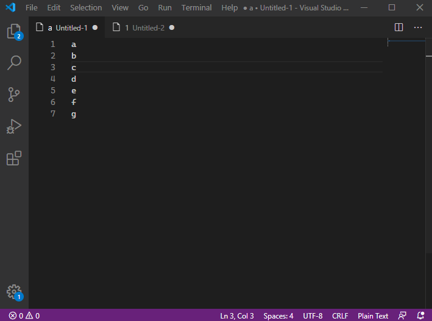

# columnpaste README

This is a column copy/paste extension.

## Features

This extension has only one feature: copy multiline column then paste into multiline.

You can use column mode to select multiline and then paste the content into these lines.

ctrl+alt+v "column paste"

## How to Use:

Select multiline content and press ctrl+c to copy, then select one line or multiline with column mode and press ctrl+alt+v to paste.

### 0.0.2
change readme

### 0.0.1

Initial release of columnpaste

### Known Issue

Need undo more times go back before pasting. 

**Enjoy!**
